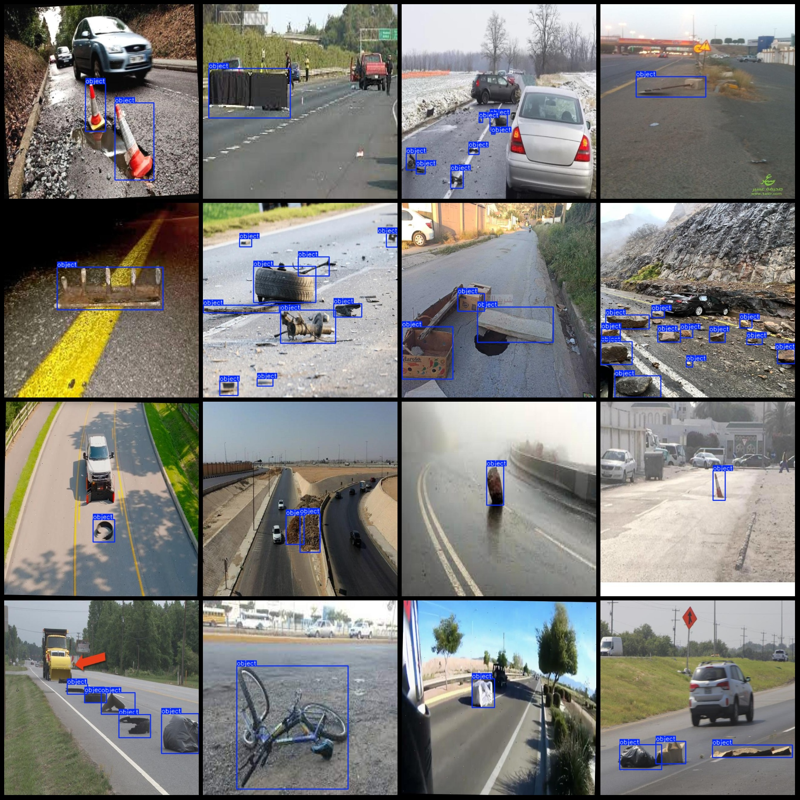
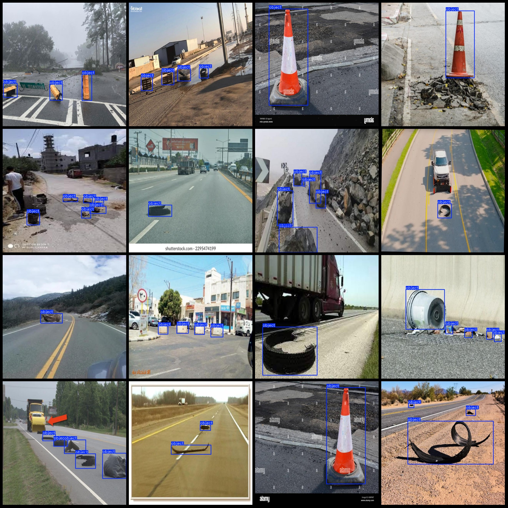

# Intelligent Transportation Roadway Objects Identification Dataset: Pascal VOC + YOLO format (233 images, 1 category)

Dataset format: Pascal VOC format + YOLO format (without the split path in the txt file, only containing jpg images and corresponding VOC format xml files and YOLO format txt files)
Number of images (jpg file count): 233
Number of annotations (xml file count): 233
Number of annotations (txt file count): 233
Number of annotation categories: 1
Annotation category numbering (not consistent with this according to the labels folder classes.txt): ["object"]
Number of bounding box per category:
Object bounding boxes = 719
Total bounding boxes: 719
Image resolution: 640x640
Annotation tool used: labelImg
Annotation rules: draw a rectangle around the category
Important note: No specific statement is provided at the moment
Special declaration: This dataset does not guarantee the accuracy of the trained model or weight files
Image preview:
Annotation example:

## Images

Here is a pay link on Stripe ( https://buy.stripe.com/3cs8yP7sY87d0vu9AB ). Please contact me lonlonago@foxmail.com after funding $89, and I will send you a complete data files , thank you!

